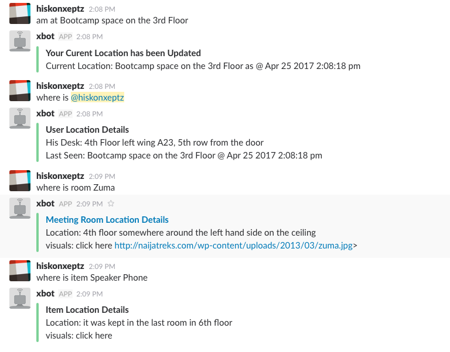

# xBot

## Introduction

> xBot helps users locate `other users Desk and last seen location`, `meeting room location` and  `items location`

## Sample Usage

## Try the Bot Out

> Join the slack team [xmileBots](https://xmilebots.slack.com/) and say Hi to xBot to view all possible command and interact with the bot
